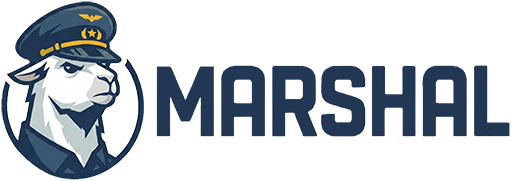
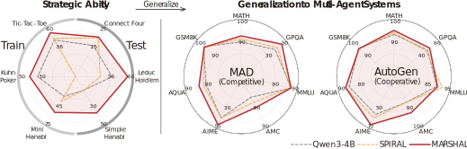

<div align="center">

</div>

<br>

<div align="center">



# MARSHAL: Incentivizing Multi-Agent Reasoning <br> via Self-Play with Strategic LLMs

[](https://opensource.org/licenses/Apache-2.0)
[](https://www.python.org/downloads/release/python-390/)
[](https://arxiv.org/abs/2510.15414)

[**🌐 Project Page**](https://thu-nics.github.io/MARSHAL/) | [**📝 Paper**](https://arxiv.org/abs/2510.15414) | [**🤗 Models**](https://huggingface.co/collections/nics-efc/marshal)

</div>

---

## 📖 Overview

We introduce **MARSHAL**, an end-to-end reinforcement learning framework designed to incentivize **M**ulti-**A**gent **R**easoning through **S**elf-play wit**H** str**A**tegic **L**LMs in a diverse range of competitive and cooperative games. 

MARSHAL addresses the challenge of credit assignment in multi-agent multi-turn self-play through two core mechanisms:
1.  **Turn-level Advantage Estimator:** Enables fine-grained credit assignment, allowing the model to accurately attribute long-term outcomes to individual actions and provide learning signals across multiple turns.
2.  **Agent-specific Advantage Normalization:** Stabilizes the training
process by calibrating advantage estimates relative to the performance of each agent.

### 🔥 Key Results
By leveraging self-play across strategic games, MARSHAL (based on Qwen3-4B) demonstrates notable generalization capabilities:
- **Strategic Games:** Achieves up to **28.7%** performance improvement on held-out games.
- **Reasoning Benchmarks:** When integrated into leading multi-agent systems (MASs), MARSHAL yields consistent gains of up to
    - **+10.0%** on AIME
    - **+7.6%** on GPQA-Diamond
    - **+3.5%** on average across all tested benchmarks.

### 🎮 Featured Games
- **Competitive, perfect-information:** Tic-Tac-Toe, Connect Four.
- **Competitive, imperfect-information:** Kuhn Poker, Leduc Hold'em.
- **Cooperative, imperfect-information:** Mini Hanabi, Simple Hanabi.

---

## 🚀 Method

<div align="center">

</div>

> **Figure 1: Overview of MARSHAL.** > **Left:** Generating player trajectories via self-play in strategic games. 
> **Middle:** Naive advantage estimation (e.g., GRPO) often fails in multi-turn settings. 
> **Right:** MARSHAL's advantage estimation ensures accurate credit assignment for multi-turn, multi-agent interactions.

## 📊 Results

<div align="center">
  
</div>

> **Figure 2: Performance Comparison.** > Evaluation of MARSHAL against baselines on strategic games and reasoning benchmarks. MARSHAL not only masters strategic games but also generalizes effectively to complex reasoning tasks within multi-agent frameworks like MAD and AutoGen.

---

## 🛠️ Installation

The MARSHAL project is built upon the [ROLL](https://github.com/alibaba/ROLL) framework.

1. **Install ROLL Framework** Please follow the official guide to ensure environment and backend compatibility:  
   [ROLL Docs – Getting Started](https://alibaba.github.io/ROLL/docs/English/start)

2. **Install OpenSpiel** MARSHAL uses [OpenSpiel](https://github.com/deepmind/open_spiel) for game environments:
   ```bash
   pip install pyspiel
   ```

---

## ⚡ Training

### Agentic RL Pipeline

Use the following scripts to reproduce our training results.

```bash
# ==============================
# 1. Self-play Training
# ==============================

# Generalist Agent (Multi-Game)
bash examples/multi_games/run_agentic_pipeline_multi_games_selfplay.sh

# Specialist Agent (e.g., Tic-Tac-Toe)
bash examples/tictactoe/run_agentic_pipeline_tictactoe_selfplay.sh

# ==============================
# 2. Training with Fixed Opponent
# ==============================
bash examples/tictactoe/run_agentic_pipeline_tictactoe_single.sh

# ==============================
# 3. Debugging / Rollout
# ==============================
# Rollout only (no gradient updates)
bash examples/tictactoe/run_agentic_rollout_tictactoe.sh
```

### Monitoring

Track training progress using TensorBoard:

```bash
tensorboard --logdir=runs/tictactoe_selfplay/
```

-----

## 🧪 Evaluation

### 1\. Export Model Checkpoint

Convert the trained checkpoint for evaluation:

```bash
bash model_convert.sh
```

### 2\. Strategic Ability Evaluation

Evaluate the agent's performance in game environments:

```bash
bash examples/model_game_eval/run_agentic_rollout_eval.sh
```

### 3\. Generalization to Multi-Agent Systems

We evaluate MARSHAL on 7 math and QA benchmarks using [MASLab](https://github.com/MASWorks/MASLab).

  * **MATH:** GSM8K, MATH500, AQUA, AIME24, AMC23
  * **QA:** GPQA-Diamond, MMLU-STEM

-----

## 🖊️ Citation

If you find our work helpful, please cite:

```bibtex
@misc{yuan2025marshal,
      title={MARSHAL: Incentivizing Multi-Agent Reasoning via Self-Play with Strategic LLMs}, 
      author={Huining Yuan and Zelai Xu and Zheyue Tan and Xiangmin Yi and Mo Guang and Kaiwen Long and Haojia Hui and Boxun Li and Xinlei Chen and Bo Zhao and Xiao-Ping Zhang and Chao Yu and Yu Wang},
      year={2025},
      eprint={2510.15414},
      archivePrefix={arXiv},
      primaryClass={cs.AI},
      url={[https://arxiv.org/abs/2510.15414](https://arxiv.org/abs/2510.15414)}, 
}
